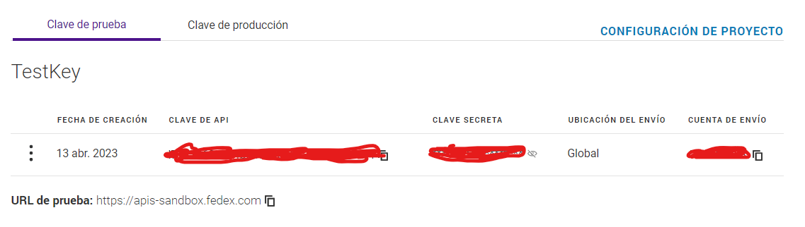

# Manuable Project.

This repository contains the Rails API and the Fedex custom library
It also contains the Docker configuration for testing api locally.


It gets the shipping rates from the FedEx API.


## What you need.
****

If you want to test this API locally, you can do it either having Docker installed or the correct Ruby version installed.

* Without Docker

1. Ruby 3.0.4
2. Ruby on Rails 7.0.4.3

* With Docker.

1. Docker.
2. Dev Containers VS Code Extension.

* Both configurations.

1. VS Code.
2. Postman or any other platform to make HTTP requests.

## Cloning
****

In order to clone this repository, follow these steps.

1. Clone this repository in your local computer.

2. Install the Dev Containers VS Code extension.

3. Type ctrl + shift + p and select the option **Rebuild container and reopen without cache**.

4. Wait until the installation is ready.

5. The script attached will run automatically when the container is ready which will run **bundle install** to install the gems for the API.

6. If the script failed, go to the manuable-api folder and install the app gems.

```bash
$ cd manuable-api
$ bundle install
```

7. Launch the server.

```bash
$ cd rails s
```

8. Start making http request to this api.

## How it works.
****
Before to get started, make sure to have a project created under the FedEx services. Get the API Keys and your account id.



Save your API Keys to use it on each HTTP request.

### Get Access Token.
****
Now, you will need the **access token** to get the shipping rates. You can get your access_token using the Rails API. Open Postman or any other software you preferred, start the rails server and get your access token.

Within the Headers section, add your API_KEY and your SECRET_KEY.

* Request
```
POST http://127.0.0.1:3000/api/sessions/authenticate/token
```
* Headers
```
cliend_id: CLAVE API,
client_secret: CLAVE SECRETA
```

Response.
```json
  { "access_token": 'afd i7we8tgidbv7.....' }
```


### Get Shipping Rates.
****
Once you have your **access_token**, open a new window in Postman and start getting the shipping rates. You will need to add the **access_token** and your **account_id** in your Headers.

* Request
```
POST http://127.0.0.1:3000/api/v1/shipping/rates
```

* Headers
```json
Content-Type: application/json,
authorization: Bearer access_token.....
account: account_id
```
* Body
```json
{
    "quote_params": {
        "address_from": {
            "zip": "64000",
            "country": "mx"
        },
        "address_to": {
            "zip": "78421",
            "country": "mx"
        },
        "parcel": {
            "length": 25.0,
            "width": 28.0,
            "height": 46.0,
            "distance_unit": "cm",
            "weight": 10,
            "mass_unit": "kg"
        }
    }
}
```
* Response.
```json
{
  "results": [
    {
      "price": 615.04,
      "currency": "mxn",
      "service_level": {
          "name": "Standard overnight",
          "token": "STANDARD_OVERNIGHT"
      }
    },
    {
      "price": 354.26,
      "currency": "mxn",
      "service_level": {
          "name": "Fedex express saver",
          "token": "FEDEX_EXPRESS_SAVER"
      }
    }
  ]
}
```


## Author.

* Jorge Ortiz.
* Software engineer.
* ortiz.mata.jorge@gmail.com
